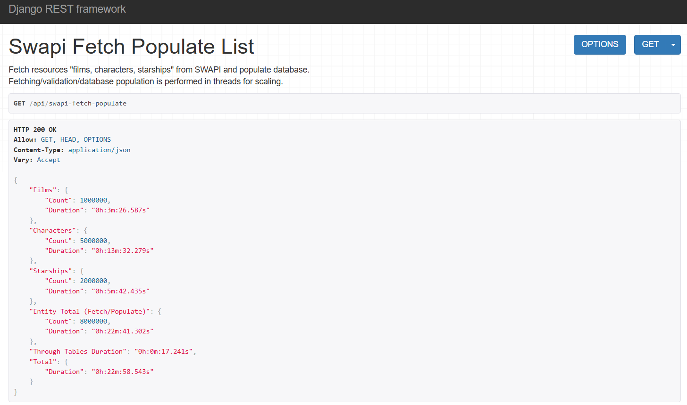
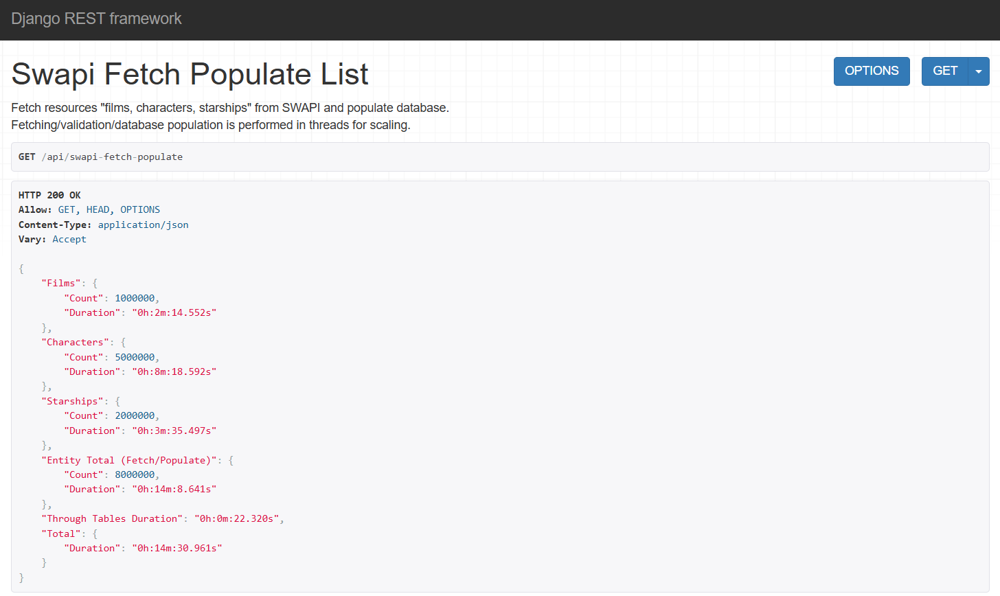

# Star Wars API

This branch focuses on demonstrating the SWAPI data ingestion workflow under high load.
It does not cover setup, testing, or deployment instructions (those are detailed in other branches).
Instead, it implements a complete solution for stress-testing the pipeline using:

- A mock SWAPI service implemented in FastAPI to simulate fast paginated responses on large resource numbers.
- Threaded, page-by-page ingestion of resources to test concurrency and parallel database operations.
- ***COPY-based bulk creation of entities*** for maximum throughput, avoiding ORM overhead.
- A staged relationship table to hold M2M links and ***chunked through-table population*** for efficiency.
- ***Indexed database columns*** to optimize join performance with entity tables.
- Efficient handling of data validation and transactional inserts.

> The branch is intended for ***performance and workflow testing***, allowing evaluation of ingestion speed, memory usage, and the efficiency of staged table joins and bulk inserts under simulated high-load conditions.

***Disclaimer***  
> This workflow is experimental and does not claim to represent an optimal implementation or guaranteed performance results.

<h2 style="display: inline;">Design/Implementation details</h2>

### Staged Relationship Table
- A single StagedRelationship table temporarily stores relationships between resources using SWAPI IDs (from_swapi_id, to_swapi_id).
- This avoids keeping large mappings in memory, and the table is indexed for fast join operations.
- After all entities are inserted, this table is used to populate the corresponding many-to-many through tables in bulk

### Database schema

### Parallel Page Ingestion
- Resources are fetched page by page using a thread pool.
- Each worker thread manages its own database connection lifecycle to prevent conflicts and leaks.
- Validation and transformation of the fetched data is performed via DRF serializers.

### Entity Insertion (COPY vs Bulk Insert)
- Initial tests with ***Django’s bulk_create*** showed entity insertion dominated runtime ***(~21–22 minutes total)***.
- Switching to ***Postgres COPY*** reduced entity insertion time dramatically, cutting total pipeline runtime to ***~14–15 minutes***.

### Through Table Population
- Once all entities are ingested, the system populates the many-to-many through tables by joining the staged relationship table with the entity tables.
- Originally, unchunked population required ***~11–12 minutes***.
- After switching to ***chunked SQL inserts***, this dropped to ***~15–20 seconds***.

### Atomic Transactions
- Each page ingestion and entity/staged table creations is wrapped in a transaction, ensuring data consistency and automatic rollback in case of errors.

### Performance Considerations
- ***COPY-based*** inserts minimize ORM overhead and maximize throughput.
- Using a single indexed staged table reduces memory usage while maintaining efficient bulk inserts.
- Threading ensures parallel fetches and reduces total ingestion time.

<h2 style="display: inline;">Flow</h2>

#### Description
- Fetch pages of SWAPI resources in parallel.
- Insert validated entities into the corresponding tables (via COPY).
- Store all relationships in the StagedRelationship table (via COPY).
- Populate many-to-many through tables using chunked SQL bulk inserts.

#### Diagram

<h2 style="display: inline;">Results</h2>

#### Successful process results with:
- **1.000.000** Film entities
- **5.000.000** Character entities
- **2.000.000** Starship entities

#### Case 1
- Chunked through table inserts
- Entity/Staged table without COPY

#### Case 2
- Chunked through table inserts
- Entity/Staged table with COPY

#### Performance Gains Summary
- Entity inserts ***(bulk_create → COPY): 21–22 minutes → 14–15 minutes***
- Through table population ***(unchunked → chunked): 11–12 minutes → 15–20 seconds***
- Overall ingestion runtime: ***~33 minutes → ~15 minutes total***

