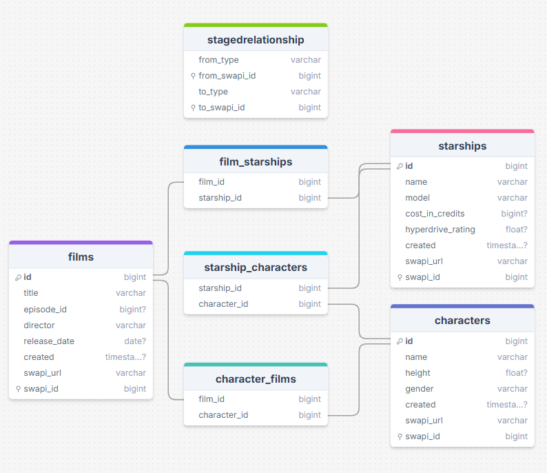
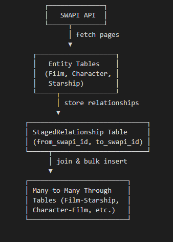
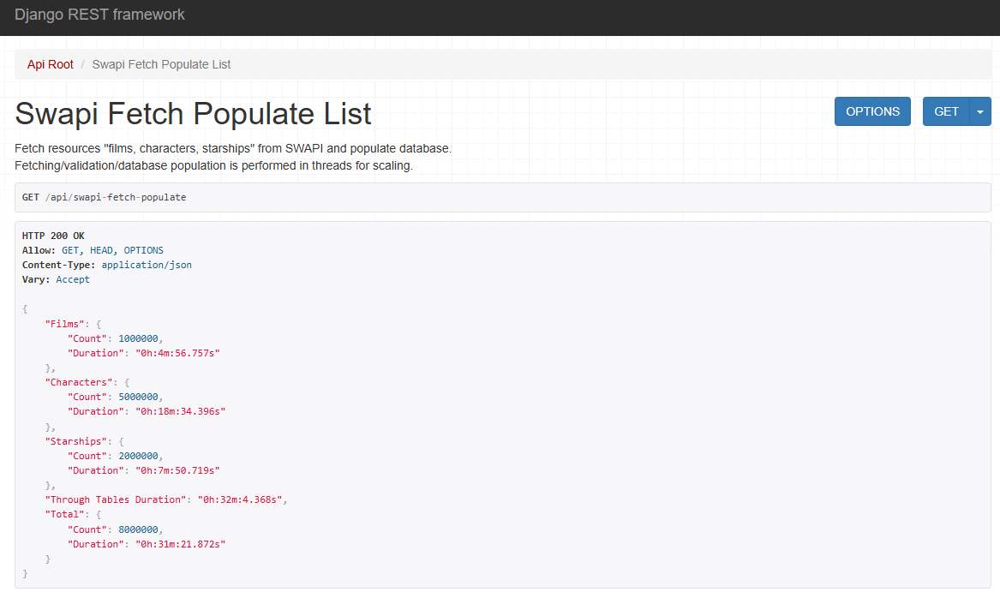

# Star Wars API

This branch focuses on demonstrating the SWAPI data ingestion workflow under high load.  
It does not cover setup, testing, or deployment instructions (those are detailed in other branches).  
Instead, it implements a complete solution for stress-testing the pipeline using:

- A mock SWAPI service implemented in FastAPI to simulate fast paginated responses on large resource numbers.
- Threaded, page-by-page ingestion of resources to test concurrency and parallel database operations.
- Bulk creation of entities and many-to-many relationships using a staged relationship table.
- Indexed database columns to optimize join performance with entity tables.
- Efficient handling of data validation, transactional inserts, and conflict resolution in through tables.

> The branch is intended for ***performance and workflow testing***, allowing evaluation of ingestion speed, memory usage, and the efficiency of staged table joins and bulk inserts under simulated high-load conditions.

***Disclaimer***  
> This workflow is experimental and does not claim to represent an optimal implementation or guaranteed performance results.

<h2 style="display: inline;">Design/Implementation details</h2>

### Staged Relationship Table
- A single StagedRelationship table temporarily stores relationships between resources using SWAPI IDs (from_swapi_id, to_swapi_id).
- This avoids keeping large mappings in memory, and the table is indexed for fast join operations.
- After all entities are inserted, this table is used to populate the corresponding many-to-many through tables in bulk.
- In this branch we experiment with ***partitioning the StagedRelationship*** using the [django-postgres-extra](https://django-postgres-extra.readthedocs.io/en/latest/table_partitioning.html) package and following the [PostgreSQL Partitioning in Django](https://pganalyze.com/blog/postgresql-partitioning-django) resource.

### Database schema

### Parallel Page Ingestion
- Resources are fetched page by page using a thread pool.
- Each worker thread manages its own database connection lifecycle to prevent conflicts and leaks.
- Validation and transformation of the fetched data is performed via DRF serializers.

### Through Table Population
- Once all entities are ingested, the system populates the many-to-many through tables by joining the staged relationship table with the entity tables.
- This is done in a single bulk operation per resource type, using raw SQL inserts.

### Atomic Transactions
- Each page ingestion and entity creation is wrapped in a transaction, ensuring data consistency and automatic rollback in case of errors.

### Performance Considerations
- Using a single indexed staged table reduces memory usage while maintaining efficient bulk inserts.
- Threading ensures parallel fetches and reduces total ingestion time.

<h2 style="display: inline;">Flow</h2>

#### Description
- Fetch pages of SWAPI resources in parallel.
- Insert validated entities into the corresponding tables.
- Store all relationships in the StagedRelationship table.
- Populate many-to-many through tables using bulk inserts, joining with the entity tables.

#### Diagram

<h2 style="display: inline;">API screenshots</h2>

#### SWAPI Fetch Populate (Threaded) Success
Results with:
- **1.000.000** Film entities
- **5.000.000** Character entities
- **2.000.000** Starship entities

As we can see partitioning in this case ***degrades performance instead of increasing it***

<h2 style="display: inline;">Partitioning steps</h2>

#### Migrations
- `uv run python manage.py pgmakemigrations --name staged_relationship_partitioned`
- `uv run python manage.py makemigrations --empty app --name define_partitions`
- `uv run python manage.py migrate`

#### SQL Checks (PostgreSQL)

- Check Partitions: `SELECT inhrelid::regclass AS partition FROM pg_inherits WHERE inhparent = 'app_stagedrelationship'::regclass;`
- Check Indexes: `SELECT tablename, indexname, indexdef FROM pg_indexes WHERE schemaname = 'public' AND tablename LIKE 'app_stagedrelationship%';`

