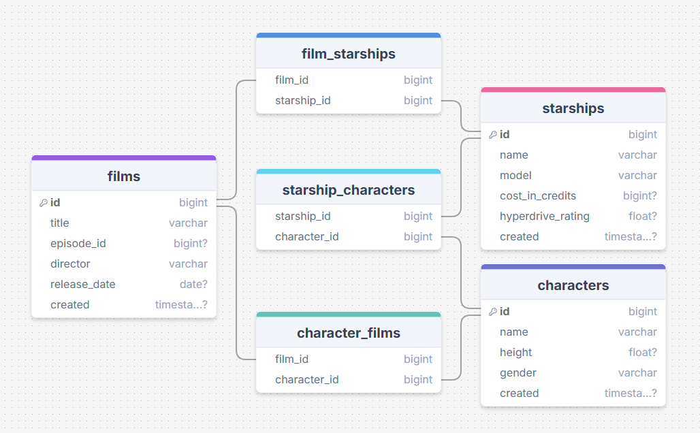
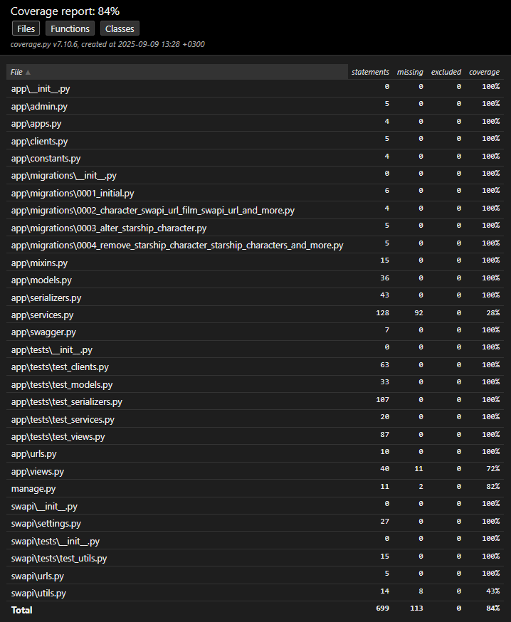
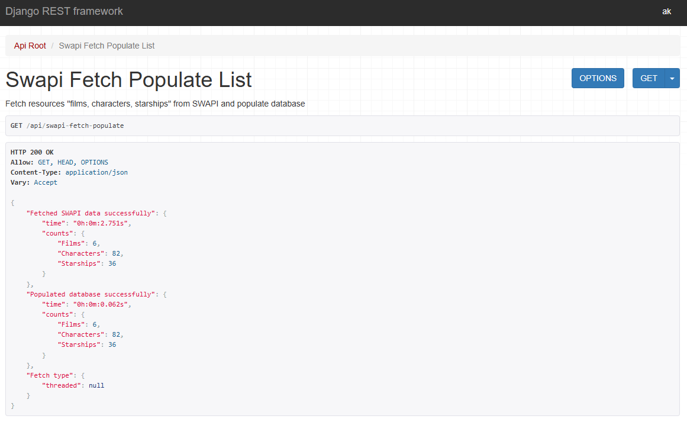
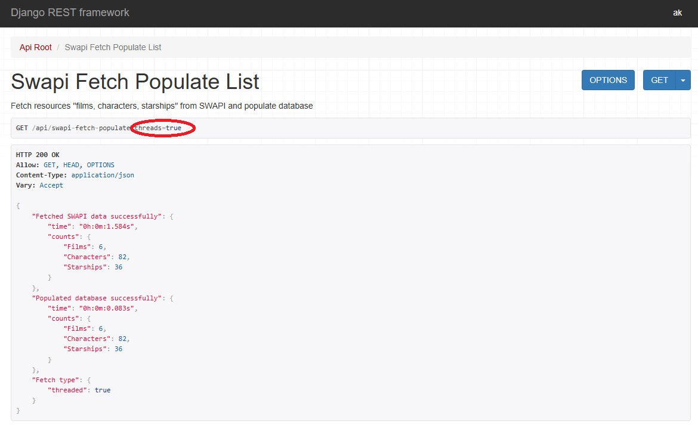
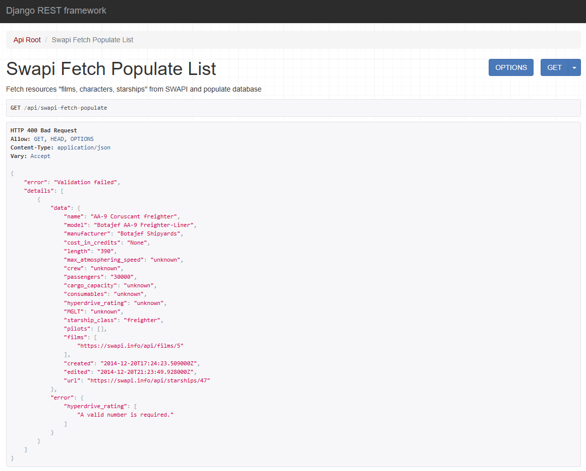
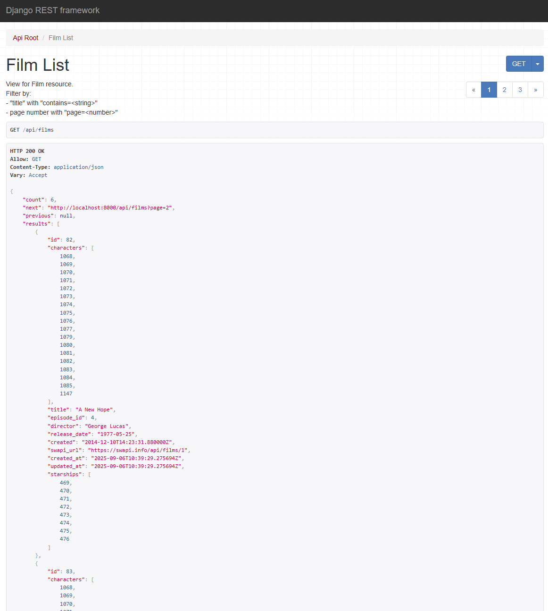
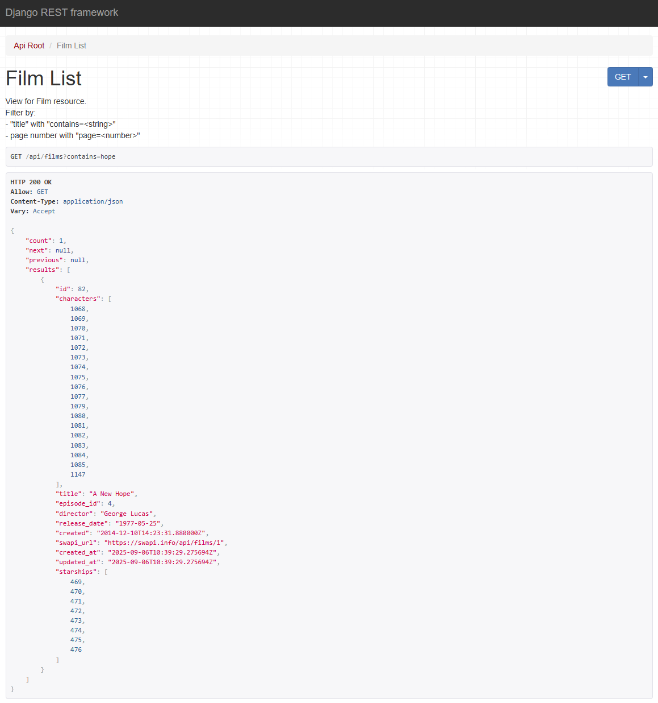
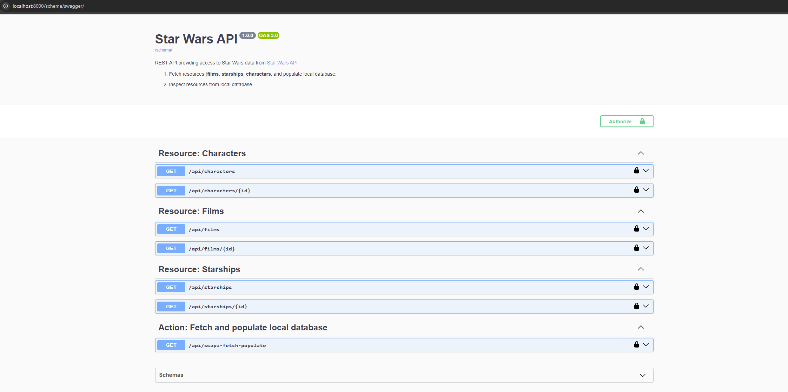

# Star Wars API

<h2 style="display: inline;">Setup/Run and Testing Workflow</h2>

<!-- ### uv installation
- Install uv (Linux/Git Bash): `$ curl -LsSf https://astral.sh/uv/install.sh | sh`
- Enable shell autocompletion for uv commands (sh) (Linux/Git Bash): `$ echo 'eval "$(uv generate-shell-completion bash)"' >> ~/.bashrc`
- Check uv availability: `$ uv` -->

### Clone project
- Clone project: `git clone https://github.com/akotronis/StarWarsAPI.git` or `git clone git@github.com:akotronis/StarWarsAPI.git`
- Go to cloned project folder: `$ cd StarWarsAPI`

### .env file
- Create a _../StarWarsAPI/.env_ file

#### Django settings:
Create a _secret_key_ and put it as value on the _SECRET_KEY_ variable of the _../StarWarsAPI/.env_ file: `..StarWarsAPI$ docker exec -it ctr-sw-back bash -c "python -c \"import os; print(os.urandom(40).hex())\""`

#### Rest environment variables:
Create environment variables as below (indicative values) and put them in the _../StarWarsAPI/.env_ file:
- `POSTGRES_DB=db`
- `POSTGRES_USER=admin`
- `POSTGRES_PASSWORD=password`
- `POSTGRES_HOST=host`
- `POSTGRES_INTERNAL_PORT=5432`
- `POSTGRES_EXTERNAL_PORT=5432`
- `BACKEND_INTERNAL_PORT=8000`
- `BACKEND_EXTERNAL_PORT=8000`

### Launch the project
- `..StarWarsAPI$ docker compose up -d`

### Urls
#### Interfaces
- Django admin: `http://localhost:8000/admin`
- Browser API: `http://localhost:8000/api`
- Swagger: `http://localhost:8000/schema/swagger`

#### Resources
- Films: `http://localhost:8000/api/films`
- Characters: `http://localhost:8000/api/characters`
- Starships: `http://localhost:8000/api/starships`

#### Fetch SWAPI data and populate database
- `http://localhost:8001/api/swapi-fetch-populate`

### Tests and coverage report
- Run the tests with coverage and generate html report: `..StarWarsAPI$ docker exec -it ctr-sw-back bash -c "python -m coverage run manage.py test && python -m coverage html"`
- Inspect _../StartWarsAPI/coverage/backend/htmlcov/index.html_ coverage report

<h2 style="display: inline;">Design/Implementation details</h2>

### Database schema
- The SWAPI resource payloads suggests the object relations depicted in the below diagram ([DrawSQL](https://drawsql.app/teams/akotronis-team/diagrams/starwarsapi)), where:
    - _Characters_ correspond to the _People_ SWAPI url resource and to the _"pilots"_ field in _Starships_ resource.
    - _Selected_ fields are used (indicatively) for the models represenations.

### Implementation
- Views/Serializers:
    - Used Mixin Pattern to ensure DRY principle
- Services:
    - Used separate resource-specific creation functions to maintain clarity and avoid over-abstracting distinct domain logic.
    - Traded temporary memory usage for database performance using in-memory mappings and bulk operations to minimize queries.

<h2 style="display: inline;">Coverage Report</h2>

<h2 style="display: inline;">Sample API screenshots</h2>

#### SWAPI Fetch Populate Success

#### SWAPI Fetch Populate (Threaded) Success

#### SWAPI Fetch Populate Validation Errors

#### Films Paginated Response

#### Films Filter Param Search

#### Swagger

